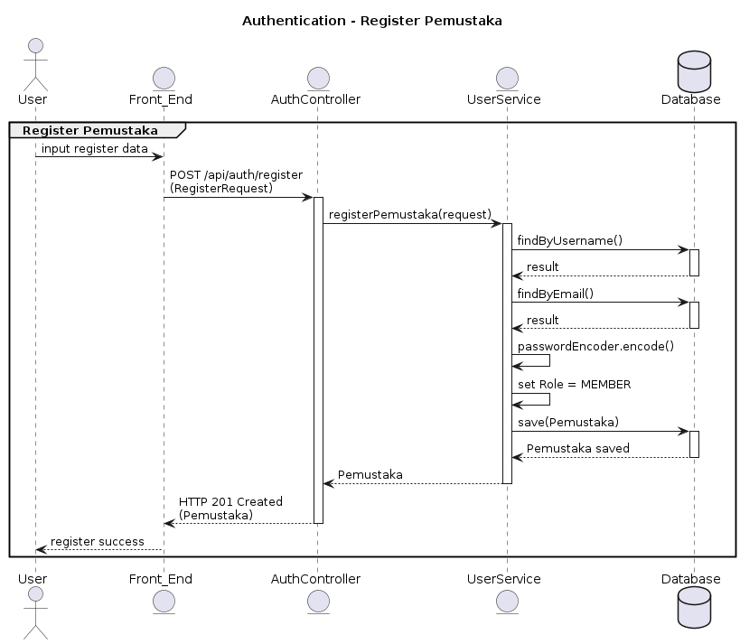

```
@startuml
title Authentication - Register Pemustaka

actor User
entity Front_End
entity AuthController
entity UserService
database Database

group Register Pemustaka
    User -> Front_End: input register data
    Front_End -> AuthController: POST /api/auth/register\n(RegisterRequest)
    activate AuthController

    AuthController -> UserService: registerPemustaka(request)
    activate UserService

    UserService -> Database: findByUsername()
    activate Database
    Database --> UserService: result
    deactivate Database

    UserService -> Database: findByEmail()
    activate Database
    Database --> UserService: result
    deactivate Database

    UserService -> UserService: passwordEncoder.encode()
    UserService -> UserService: set Role = MEMBER
    UserService -> Database: save(Pemustaka)
    activate Database
    Database --> UserService: Pemustaka saved
    deactivate Database

    UserService --> AuthController: Pemustaka
    deactivate UserService

    AuthController --> Front_End: HTTP 201 Created\n(Pemustaka)
    deactivate AuthController

    Front_End --> User: register success
end
@enduml
```
```
