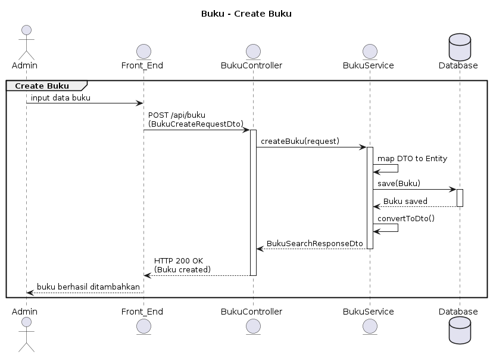

```
@startuml
title Buku - Create Buku

actor Admin
entity Front_End
entity BukuController
entity BukuService
database Database

group Create Buku
    Admin -> Front_End: input data buku
    Front_End -> BukuController: POST /api/buku\n(BukuCreateRequestDto)
    activate BukuController

    BukuController -> BukuService: createBuku(request)
    activate BukuService

    BukuService -> BukuService: map DTO to Entity
    BukuService -> Database: save(Buku)
    activate Database
    Database --> BukuService: Buku saved
    deactivate Database

    BukuService -> BukuService: convertToDto()
    BukuService --> BukuController: BukuSearchResponseDto
    deactivate BukuService

    BukuController --> Front_End: HTTP 200 OK\n(Buku created)
    deactivate BukuController

    Front_End --> Admin: buku berhasil ditambahkan
end
@enduml

```

```
