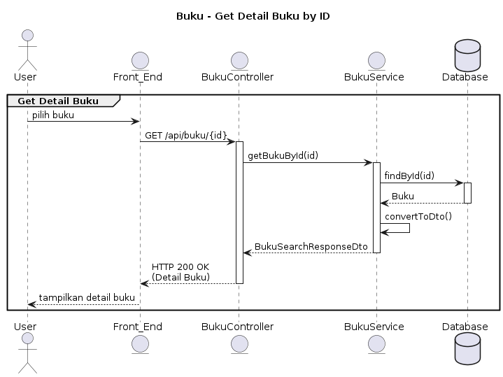

```
@startuml
title Buku - Get Detail Buku by ID

actor User
entity Front_End
entity BukuController
entity BukuService
database Database

group Get Detail Buku
    User -> Front_End: pilih buku
    Front_End -> BukuController: GET /api/buku/{id}
    activate BukuController

    BukuController -> BukuService: getBukuById(id)
    activate BukuService

    BukuService -> Database: findById(id)
    activate Database
    Database --> BukuService: Buku
    deactivate Database

    BukuService -> BukuService: convertToDto()
    BukuService --> BukuController: BukuSearchResponseDto
    deactivate BukuService

    BukuController --> Front_End: HTTP 200 OK\n(Detail Buku)
    deactivate BukuController

    Front_End --> User: tampilkan detail buku
end
@enduml
```
