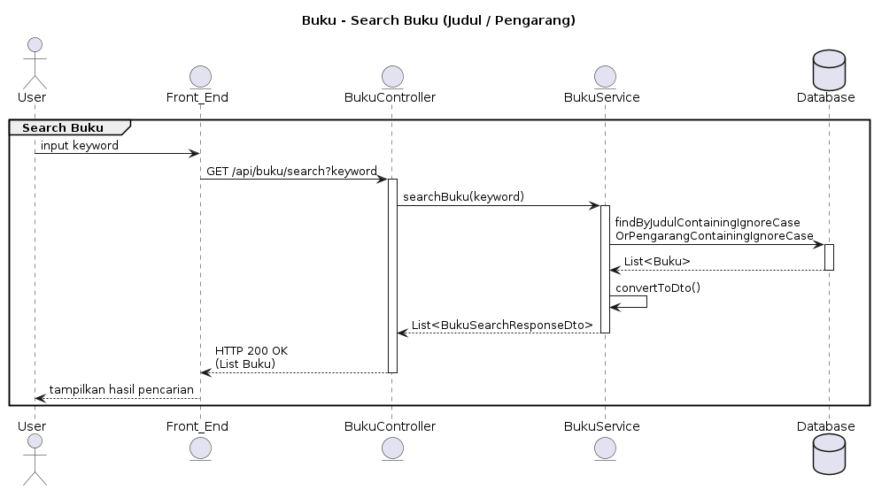

```
@startuml
title Buku - Search Buku (Judul / Pengarang)

actor User
entity Front_End
entity BukuController
entity BukuService
database Database

group Search Buku
    User -> Front_End: input keyword
    Front_End -> BukuController: GET /api/buku/search?keyword
    activate BukuController

    BukuController -> BukuService: searchBuku(keyword)
    activate BukuService

    BukuService -> Database: findByJudulContainingIgnoreCase\nOrPengarangContainingIgnoreCase
    activate Database
    Database --> BukuService: List<Buku>
    deactivate Database

    BukuService -> BukuService: convertToDto()
    BukuService --> BukuController: List<BukuSearchResponseDto>
    deactivate BukuService

    BukuController --> Front_End: HTTP 200 OK\n(List Buku)
    deactivate BukuController

    Front_End --> User: tampilkan hasil pencarian
end
@enduml
```
